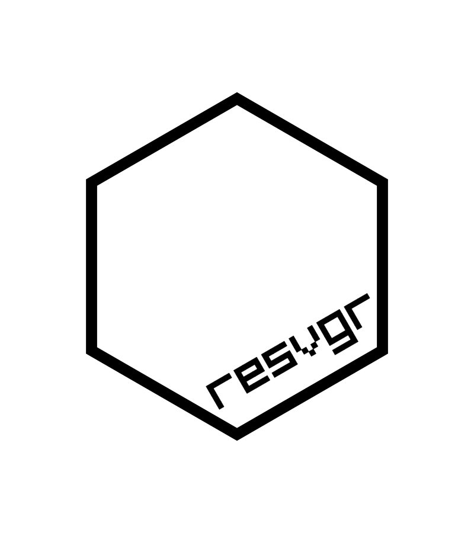

<!-- README.md is generated from README.Rmd. Please edit that file -->

# resvgr 

<!-- badges: start -->


<!-- badges: end -->

`{resvgr}` is a very alpha wrapper for the
[`resvg`](https://github.com/RazrFalcon/resvg) SVG rasterizer.

### Overview of `resvg` vs `librsvg`

-   `resvg` supports textPath
-   `librsvg` seems much faster
-   `resvg` has better support for SVG features according to their [test
    suite](https://razrfalcon.github.io/resvg-test-suite/svg-support-table.html)
-   `librsvg` has better CSS support
    -   `librsvg` supports the “!important” tag
    -   `librsvg` allows for passing in a global CSS
-   `resvg` is stricter about requiring that *all* SVG have a namespace
    declaration i.e. include `xmlns="http://www.w3.org/2000/svg"` in the
    `<svg>` tag

## Installation

Installation is tricky at the moment:

1.  Checkout resvg from <https://github.com/RazrFalcon/resvg>
2.  Follow instructions in the
    [`resvg/c-api`](https://github.com/RazrFalcon/resvg/tree/master/c-api)
    directory to build the C library version of `resvg`
3.  Checkout `{resvgr}` package source code from
    <https://github.com/coolbutuseless/resvgr>
4.  Edit `resvgr/src/Makevars` and change `RESVGDIR` to match where
    you’ve put `resvg`
5.  Build `{resvg}` package

If anyone knows how to use `cargo` to directly build the C library in
this package, please get in touch.

## `<textPath>` rendering in `resvg`

`resvg` has `<textPath>` support which `librsvg` currently lacks.

``` r
library(grid)
library(resvgr)

svg_text <- '<svg viewBox="0 0 100 100" xmlns="http://www.w3.org/2000/svg">

  <path id="MyPath" fill="none" stroke="red"
        d="M10,90 Q90,90 90,45 Q90,10 50,10 Q10,10 10,40 Q10,70 45,70 Q70,70 75,50" />

  <text>
    <textPath href="#MyPath">
      Quick brown fox jumps over the lazy dog.
    </textPath>
  </text>

</svg>'

nr <- resvg(svg_text, zoom = 10)
grob <- rasterGrob(nr)
grid.draw(grob)
```


## Example render

Basic example.

``` r
library(grid)
library(resvgr)

svg_text <- paste(readLines("man/figures/car-svgrepo-com.svg"), collapse = "\n")

nr <- resvg(svg_text)
grob <- rasterGrob(nr)
grid.draw(grob)
```


## Related Software

-   [`{rsvg}`](https://cran.r-project.org/package=rsvg) which wraps the
    [`librsvg`](https://gitlab.gnome.org/GNOME/librsvg) Library.

## Acknowledgements

-   R Core for developing and maintaining the language.
-   CRAN maintainers, for patiently shepherding packages onto CRAN and
    maintaining the repository
